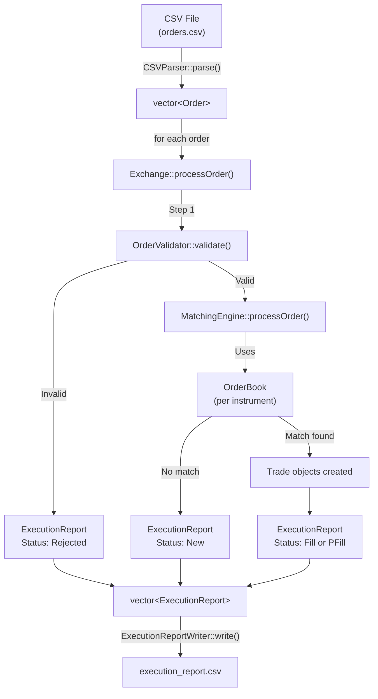
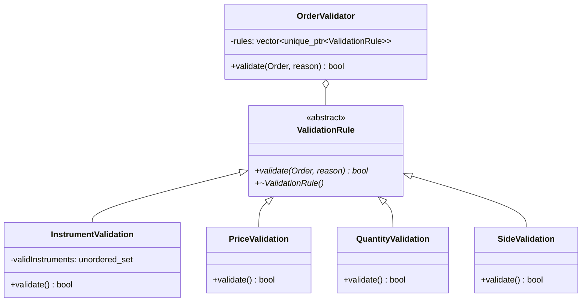

# 🌸 Flower Exchange — Complete Project Deep-Dive

## 1. What Is This Project?

A **stock-exchange simulator** for flowers. It reads buy/sell orders from a CSV file, **validates** them, **matches** compatible buys and sells using a price-time priority order book, and writes an **execution report** CSV showing what happened to every order.

> [!IMPORTANT]
> **The core concept**: When someone wants to BUY Rose at $55 and someone else already wants to SELL Rose at $45, the exchange matches them — the buyer gets a deal at the seller's (lower) price. This is exactly how real stock exchanges (NYSE, NASDAQ) work.

---

## 2. Architecture Overview



---

## 3. Project File Structure

```
src/
├── main.cpp                          # Entry point
├── model/
│   ├── Order.hpp                     # Data class for an order
│   ├── Trade.hpp                     # Data class for a match event
│   └── ExecutionReport.hpp           # Data class for output report
├── exchange/
│   ├── Exchange.hpp / .cpp           # Orchestrator (validation → matching → reports)
├── matchingengine/
│   ├── MatchingEngine.hpp / .cpp     # Core matching algorithm
├── orderbook/
│   ├── OrderBook.hpp / .cpp          # Buy/Sell priority queues
├── validator/
│   ├── ValidationRule.hpp            # Abstract base class (interface)
│   ├── OrderValidator.hpp / .cpp     # Runs all rules
│   ├── InstrumentValidation.hpp      # Checks flower name
│   ├── PriceValidation.hpp           # Checks price > 0
│   ├── QuantityValidation.hpp        # Checks 10 ≤ qty ≤ 1000, multiple of 10
│   └── SideValidation.hpp           # Checks side is 1 or 2
└── utils/
    ├── CSVParser.hpp / .cpp          # Reads input CSV → vector<Order>
    └── ExecutionReportWriter.hpp/.cpp # Writes vector<ExecutionReport> → CSV
```

---

## 4. The Complete Pipeline (main.cpp)

```
Step 1: Parse CSV        →  CSVParser::parse(inputFile) → vector<Order>
Step 2: Create Exchange   →  Exchange exchange;
Step 3: Process Orders    →  for each order: exchange.processOrder(order)
Step 4: Get Reports       →  exchange.getReports()
Step 5: Write Output CSV  →  ExecutionReportWriter::write(outputFile, reports)
```

The program accepts the input filename either as a **command-line argument** (`argv[1]`) or via **interactive prompt** (`std::getline`). It wraps everything in a `try-catch` for error handling.

---

## 5. Data Models (model/)

### 5.1 Order

| Field | Type | Meaning |
|-------|------|---------|
| `mClientOrderId` | `string` | Client's own ID (e.g. `"aa13"`) |
| `mOrderId` | `string` | System-generated (e.g. `"ord1"`, `"ord2"`) |
| `mInstrument` | `string` | Flower name (`"Rose"`, `"Tulip"`, etc.) |
| `mSide` | `int` | `1` = Buy, `2` = Sell |
| `mPrice` | `double` | Price per unit |
| `mQuantity` | `int` | Number of units (gets reduced during trades) |
| `mSequence` | `int` | Arrival order (0, 1, 2, ...) — for time-priority |

**Key method**: `reduceQuantity(int qty)` — subtracts from `mQuantity` after a partial trade.

### 5.2 Trade

Captures **one match event** between two orders:

| Field | Meaning |
|-------|---------|
| `aggressiveClientOrderId/OrderId/Side` | The **incoming** order that triggered the match |
| `passiveClientOrderId/OrderId/Side` | The **resting** order already in the book |
| `executionPrice` | Always the **passive order's price** (the order already in the book) |
| `matchedQuantity` | How many units were traded |
| `aggressiveRemainingAfter` | Remaining qty of incoming order after this trade |
| `passiveRemainingAfter` | Remaining qty of resting order after this trade |

> [!NOTE]
> **Why is execution price always the passive's price?** This is standard exchange behavior called **"passive price priority"**. The resting order was placed first, so it gets its requested price. The incoming (aggressive) order gets a deal equal to or better than what they asked for.

### 5.3 ExecutionReport

The output record. Fields: `ClientOrderId`, `OrderId`, `Instrument`, `Side`, `Price`, `Quantity`, `Status`, `Reason`, `TransactionTime`.

**Status values**:
- **`New`** — Order was valid, added to book, no match found
- **`Fill`** — Order was completely filled (remaining quantity = 0)
- **`PFill`** — Partial Fill — order was partially matched (still has remaining quantity)
- **`Rejected`** — Order failed validation

---

## 6. Validation System (validator/)

### 6.1 Design Pattern: Strategy Pattern



### 6.2 ValidationRule (Abstract Base Class)

```cpp
class ValidationRule {
public:
    virtual ~ValidationRule() = default;
    virtual bool validate(const Order& order, std::string& reason) const = 0;
};
```

**C++ concepts used here**:

- **`virtual`** — enables runtime polymorphism. When you call `rule->validate()`, C++ looks up the actual object type at runtime (not the pointer type) to decide which `validate()` to call.
- **`= 0`** — makes it a **pure virtual function**, meaning this class is **abstract** — you cannot create a `ValidationRule` object directly. Subclasses MUST override this method.
- **`virtual ~ValidationRule() = default`** — **virtual destructor** ensures that when you `delete` through a base pointer, BOTH the derived class destructor AND the base class destructor run. Without `virtual`, only `~ValidationRule()` would run, potentially causing memory leaks.
- **`const` after method signature** — promises the method won't modify the object's member variables.

### 6.3 The Four Validation Rules

| Rule | Condition | Rejection Reason |
|------|-----------|-----------------|
| **InstrumentValidation** | Must be one of: `Rose`, `Lavender`, `Lotus`, `Tulip`, `Orchid` | `"Invalid instrument"` |
| **PriceValidation** | Must be `> 0` | `"Invalid price"` |
| **QuantityValidation** | Must be `10 ≤ qty ≤ 1000` AND multiple of 10 | `"Quantity out of range"` or `"Quantity must be multiple of 10"` |
| **SideValidation** | Must be `1` (buy) or `2` (sell) | `"Invalid side"` |

`InstrumentValidation` uses an `std::unordered_set<string>` for **O(1) average** lookup time.

### 6.4 OrderValidator — The Orchestrator

```cpp
OrderValidator::OrderValidator() {
    rules.push_back(std::make_unique<InstrumentValidation>());
    rules.push_back(std::make_unique<PriceValidation>());
    rules.push_back(std::make_unique<QuantityValidation>());
    rules.push_back(std::make_unique<SideValidation>());
}

bool OrderValidator::validate(const Order& order, std::string& reason) const {
    for (const auto& rule : rules) {
        if (!rule->validate(order, reason)) {
            return false; // short-circuit: stop at first failure
        }
    }
    return true;
}
```

**Key C++ concepts**:
- **`std::unique_ptr`** — a smart pointer that **automatically deletes** the object when it goes out of scope. No manual `delete` needed. Only ONE `unique_ptr` can own the object at a time.
- **`std::make_unique<T>()`** — creates a `unique_ptr<T>` safely (exception-safe, avoids raw `new`).
- **Polymorphic dispatch** — `rule->validate()` calls the correct derived class version at runtime through the base class pointer.

---

## 7. Order Book (orderbook/)

### 7.1 What Is an Order Book?

An order book maintains two sorted lists:
- **Buy side** — sorted by **highest price first** (best buyer pays the most)
- **Sell side** — sorted by **lowest price first** (best seller asks the least)

Within the same price, orders are sorted by **arrival time** (sequence number) — **first come, first served**.

### 7.2 Data Structure: `std::multiset` with Custom Comparators

```cpp
std::multiset<std::shared_ptr<Order>, BuyComparator>  buyOrders;
std::multiset<std::shared_ptr<Order>, SellComparator> sellOrders;
```

**Why `multiset`?**
- **Automatically sorted** — every `insert()` places the element in the correct position. O(log n).
- **`multi`** — allows duplicate keys (multiple orders at the same price).
- Elements are always in order, so `begin()` always gives the "best" order.

**Why not `priority_queue`?** A `priority_queue` only lets you access/remove the top element. With `multiset`, you can also iterate, remove from the middle, etc. — more flexible.

### 7.3 Custom Comparators

```cpp
struct BuyComparator {
    bool operator()(const shared_ptr<Order>& a, const shared_ptr<Order>& b) const {
        if (a->getPrice() != b->getPrice())
            return a->getPrice() > b->getPrice();  // HIGHER price first
        return a->getSequence() < b->getSequence(); // Earlier order first (tie-breaker)
    }
};

struct SellComparator {
    bool operator()(const shared_ptr<Order>& a, const shared_ptr<Order>& b) const {
        if (a->getPrice() != b->getPrice())
            return a->getPrice() < b->getPrice();   // LOWER price first
        return a->getSequence() < b->getSequence();  // Earlier order first (tie-breaker)
    }
};
```

These are **functor classes** — classes with `operator()` overloaded, making objects callable like functions. The `multiset` calls this comparator to determine element ordering.

**This implements Price-Time Priority**: best price wins, and if prices are equal, the order that arrived first wins.

### 7.4 Match Detection

```cpp
bool OrderBook::hasMatch(const Order& incoming) const {
    if (incoming.getSide() == 1) { // BUY
        if (sellOrders.empty()) return false;
        auto bestSell = *sellOrders.begin();
        return incoming.getPrice() >= bestSell->getPrice();
    } else { // SELL
        if (buyOrders.empty()) return false;
        auto bestBuy = *buyOrders.begin();
        return incoming.getPrice() <= bestBuy->getPrice();
    }
}
```

**Matching logic**:
- A BUY matches if there's a SELL at a price ≤ the buy price (buyer willing to pay enough)
- A SELL matches if there's a BUY at a price ≥ the sell price (buyer willing to pay what seller wants)

### 7.5 Why `shared_ptr`?

`std::shared_ptr` is used because the **same Order object is referenced by multiple places**:
- The `OrderBook` stores it
- The `MatchingEngine` processes it
- The `Exchange` reads from it to build reports

`shared_ptr` uses **reference counting** — it keeps track of how many pointers reference the object. When the count drops to 0, the object is automatically deleted. This prevents both memory leaks AND dangling pointers.

---

## 8. Matching Engine (matchingengine/)

### 8.1 Multi-Instrument Support

```cpp
class MatchingEngine {
private:
    std::map<std::string, OrderBook> orderBooks;  // one OrderBook per flower
};
```

Each instrument (Rose, Tulip, etc.) has its **own separate OrderBook**. A Rose buy order only matches against Rose sell orders, never Tulip.

`std::map` provides **O(log n)** lookup by instrument name.

### 8.2 The Matching Algorithm (Core Logic)

```
processOrder(incoming, instrument):
    1. Get or create the OrderBook for this instrument
    2. WHILE there is a matching resting order:
       a. Get the best resting order (bestSell for a buy, bestBuy for a sell)
       b. tradedQty = min(incoming.quantity, bestOrder.quantity)
       c. execPrice = bestOrder.price   ← ALWAYS the passive/resting order's price
       d. Reduce both orders' quantities by tradedQty
       e. Create a Trade object capturing this match
       f. Remove the best resting order from the book
       g. If the resting order still has quantity left, re-add it to the book
    3. If the incoming order still has quantity left, add it to the book
    4. Return all Trade objects
```

### 8.3 Walkthrough Example

Using `5.csv`:
```
aa13, Rose, SELL, 100, $55.0
aa14, Rose, SELL, 100, $45.0
aa15, Rose, BUY,  200, $45.0
```

**Order aa13 (SELL 100 Rose @ $55)**:
- Book is empty → no match → added to sell side
- Report: `New`

**Order aa14 (SELL 100 Rose @ $45)**:
- No buy orders → no match → added to sell side
- Sell book now: `[$45 (aa14), $55 (aa13)]` (lowest first)
- Report: `New`

**Order aa15 (BUY 200 Rose @ $45)**:
- Check: best sell is aa14 @ $45. Buy price ($45) ≥ Sell price ($45)? YES → match!
- `tradedQty = min(200, 100) = 100`, `execPrice = $45` (passive's price)
- aa15 remaining: 100, aa14 remaining: 0
- Trade #1 created. aa14 removed from book (fully filled)
- Reports: aa15 → `PFill` (still has 100 left), aa14 → `Fill` (0 left)

- Check again: best sell is now aa13 @ $55. Buy price ($45) ≥ $55? NO → no more matches
- aa15 (remaining 100 @ $45) added to buy side of book

**Final execution report**:
```
aa13, ord1, Rose, 2, 55,  100, New
aa14, ord2, Rose, 2, 45,  100, New
aa15, ord3, Rose, 1, 45,  100, PFill   ← matched with aa14
aa14, ord2, Rose, 2, 45,  100, Fill    ← fully consumed
```

### 8.4 Why Remove and Re-add?

```cpp
orderBook.removeBestSell();
if (passiveRemaining > 0) {
    orderBook.addOrder(bestSell);
}
```

Because `multiset` elements are **immutable** — you can't change a value in-place without breaking the sort order. So we remove it, modify the quantity via `reduceQuantity()`, and re-insert it. The `shared_ptr` ensures the underlying Order object survives this remove/add cycle.

---

## 9. Exchange Class (exchange/)

The **central orchestrator** that ties everything together.

### 9.1 Members

```cpp
class Exchange {
    OrderValidator validator;           // validates incoming orders
    MatchingEngine engine;              // matches orders
    int orderIdCounter;                 // generates ord1, ord2, ord3...
    std::vector<ExecutionReport> reports; // all reports generated
};
```

### 9.2 processOrder() — The Heart of the System

```
processOrder(order):
    1. VALIDATE: validator.validate(order, reason)
       → If invalid: create Rejected report (no orderId assigned), return
    
    2. ASSIGN ORDER ID: "ord" + counter++
    
    3. WRAP in shared_ptr, set the system orderId on it
    
    4. MATCH: engine.processOrder(orderPtr, instrument) → vector<Trade>
    
    5. GENERATE REPORTS:
       → If no trades: one "New" report
       → For each trade: TWO reports —
          • Aggressive side (Fill or PFill based on remaining qty)
          • Passive side   (Fill or PFill based on remaining qty)
```

> [!IMPORTANT]
> **Rejected orders do NOT get a system OrderId** — the `orderId` field is left empty. They also never touch the order book. Only valid orders consume an orderId from the counter.

### 9.3 Fill vs PFill Logic

```cpp
trade.getAggressiveRemainingAfter() == 0 ? "Fill" : "PFill"
```

- **Fill**: remaining quantity is 0 → the order is completely satisfied
- **PFill** (Partial Fill): remaining quantity > 0 → only part of the order was matched

---

## 10. CSV I/O (utils/)

### 10.1 CSVParser

1. Opens the file with `std::ifstream`
2. Skips the header line (`std::getline(file, line)`)
3. For each subsequent line:
   - Uses `std::stringstream` to split by commas
   - `std::getline(ss, token, ',')` extracts each field
   - `std::stoi()` converts string → int, `std::stod()` converts string → double
   - Assigns a `sequence` number (0, 1, 2...) for time-priority ordering
4. Returns `vector<Order>`

**It's a `static` method** — you call it as `CSVParser::parse(file)` without creating an instance. This is appropriate because the parser holds no state.

### 10.2 ExecutionReportWriter

Opens an `std::ofstream`, writes the CSV header, then loops through all reports writing comma-separated fields. Also a `static` method.

---

## 11. Build System (CMake)

```cmake
cmake_minimum_required(VERSION 3.10)
project(ExchangeProject)
set(CMAKE_CXX_STANDARD 17)            # Uses C++17 features

file(GLOB_RECURSE SRC_FILES src/*.cpp) # Finds ALL .cpp files recursively
add_executable(exchange ${SRC_FILES})  # Compiles them into 'exchange.exe'

target_include_directories(exchange PRIVATE ${PROJECT_SOURCE_DIR}/src)
```

- **`GLOB_RECURSE`** — automatically finds `.cpp` files in all subdirectories
- **`target_include_directories`** — tells the compiler where to find header files, so `#include "model/Order.hpp"` works
- **`C++17`** — needed for features like structured bindings, `std::make_unique`, etc.

---

## 12. C++ Concepts Used (Summary for Instructor Q&A)

| Concept | Where Used | Why |
|---------|-----------|-----|
| **Classes & Encapsulation** | All model/component classes | Private data + public getters/setters |
| **Inheritance** | `ValidationRule` → concrete validations | Polymorphic validation system |
| **Pure Virtual Functions** | `ValidationRule::validate() = 0` | Forces subclasses to implement; makes class abstract |
| **Virtual Destructor** | `ValidationRule` | Ensures proper cleanup through base pointers |
| **Runtime Polymorphism** | `rule->validate()` in `OrderValidator` | Calls correct derived class method at runtime |
| **`unique_ptr`** | `OrderValidator::rules` | Automatic memory management, exclusive ownership |
| **`shared_ptr`** | `OrderBook` orders, `MatchingEngine` | Shared ownership across components |
| **`std::multiset`** | `OrderBook` | Auto-sorted container allowing duplicates |
| **Custom Comparators (Functors)** | `BuyComparator`, `SellComparator` | Define custom sort orders for the multiset |
| **Operator Overloading** | `operator()` in comparators | Makes comparator objects callable |
| **STL Containers** | `vector`, `map`, `multiset`, `unordered_set` | Efficient data storage and retrieval |
| **Exception Handling** | `try-catch` in `main.cpp` | Graceful error handling |
| **File I/O** | `ifstream`, `ofstream` | Reading/writing CSV files |
| **`stringstream`** | `CSVParser` | Parsing comma-separated values |
| **`const` correctness** | Getters, validate methods | Prevents accidental modification |
| **Pass by reference** | `const Order&`, `string&` | Avoids expensive copies |
| **`#pragma once`** | All header files | Prevents multiple inclusion (header guard) |
| **`static` methods** | `CSVParser::parse`, `ExecutionReportWriter::write` | Stateless utility functions |
| **Initializer Lists** | `ExecutionReport`, `Trade` constructors | Efficient member initialization |
| **`auto` keyword** | Throughout | Type inference for cleaner code |
| **Range-based for** | `for (const auto& order : orders)` | Modern C++ iteration |
| **Smart pointers vs raw** | Design decision in `OrderValidator` | RAII — Resource Acquisition Is Initialization |

---

## 13. Likely Instructor Questions & Answers

### Q: Why `multiset` instead of `priority_queue`?
**A:** `priority_queue` only allows access to the top element. With `multiset`, we can erase the top element, re-insert modified orders, and potentially iterate over all orders. It provides more flexibility while still maintaining sorted order. Both have O(log n) insertion.

### Q: Why `shared_ptr` for orders but `unique_ptr` for validation rules?
**A:** Validation rules are owned exclusively by `OrderValidator` — no one else needs them, so `unique_ptr` (exclusive ownership) is sufficient. Orders, however, are shared between the `OrderBook`, `MatchingEngine`, and `Exchange` — multiple components hold references to the same order, so `shared_ptr` (shared ownership with reference counting) is needed.

### Q: Why is the execution price always the passive order's price?
**A:** This follows real exchange behavior. The passive/resting order was placed first and declared a specific price. The aggressive/incoming order is willing to trade at that price or better. Using the passive price rewards the resting order for providing liquidity.

### Q: What does `= 0` mean in `virtual bool validate(...) = 0`?
**A:** It makes the function **pure virtual**, meaning subclasses MUST provide an implementation. It also makes `ValidationRule` an **abstract class** — you cannot instantiate it directly. This enforces the contract that every validation rule must define its own `validate()` logic.

### Q: Why use a virtual destructor?
**A:** When we store derived objects through base class pointers (`unique_ptr<ValidationRule>`), `delete` is called on the base pointer. Without a virtual destructor, only `~ValidationRule()` runs, skipping the derived class destructor — potential resource leak. With `virtual`, C++ correctly calls `~DerivedClass()` first, then `~ValidationRule()`.

### Q: What is the time complexity of processing one order?
**A:** Let `n` = number of orders already in the book for that instrument:
- Validation: O(1) (hash set lookup + simple checks)
- Finding best match: O(1) (multiset begin)
- Each match: O(log n) (remove + re-insert into multiset)
- If the order matches `k` resting orders: O(k · log n)
- Adding to book if unmatched: O(log n)

### Q: What happens if a buy order can match multiple sell orders?
**A:** The `while (orderBook.hasMatch(*incoming))` loop keeps matching against the best available sell order until either the buy order's quantity is exhausted or no more sells match. Each match generates a separate Trade (→ 2 execution reports). The buy order may end up as `PFill` (multiple matches but still has remaining qty) or `Fill` (fully consumed).

### Q: Why do you remove and re-add the resting order after a partial fill?
**A:** Because `multiset` elements are effectively immutable — modifying an element in-place could break the sort invariant. We remove the top element, call `reduceQuantity()` on the `shared_ptr`'s object, then re-insert it so the multiset maintains correct ordering.

### Q: What design pattern does the validator use?
**A:** The **Strategy Pattern**. `ValidationRule` is an abstract interface. Each concrete rule (`InstrumentValidation`, `PriceValidation`, etc.) is a strategy. `OrderValidator` holds a collection of strategies and iterates through them. This makes it easy to add new rules — just create a new class inheriting `ValidationRule` and add it to the vector.

### Q: What is `#pragma once`?
**A:** It's a compiler directive that ensures a header file is included only once per translation unit, preventing duplicate definitions. It's the modern alternative to traditional include guards (`#ifndef`, `#define`, `#endif`). Supported by all major compilers (GCC, Clang, MSVC).

### Q: Why pass `const Order&` instead of `Order`?
**A:** Passing by `const` reference avoids making a copy of the entire `Order` object (which has strings — expensive to copy). The `const` keyword guarantees the function won't modify the original. This is a C++ best practice for any non-trivial parameter you don't intend to modify.

### Q: What C++ standard are you using and why?
**A:** C++17 (`set(CMAKE_CXX_STANDARD 17)` in CMake). We need it for `std::make_unique` (C++14), structured bindings, and other modern features. C++17 also provides better standard library support.

### Q: How does the system handle multiple instruments simultaneously?
**A:** `MatchingEngine` uses a `std::map<string, OrderBook>` — one `OrderBook` per instrument name. When an order arrives, it looks up (or creates) the book for that instrument. Rose orders never interact with Tulip orders.

### Q: What is RAII and where do you use it?
**A:** **Resource Acquisition Is Initialization** — resources are tied to object lifetimes. When an object is created, it acquires resources; when destroyed, it releases them. Our `unique_ptr` and `shared_ptr` usage is RAII — memory is automatically freed when the smart pointer goes out of scope. `ifstream`/`ofstream` in the parsers also use RAII — the file is closed when the stream object is destroyed.
